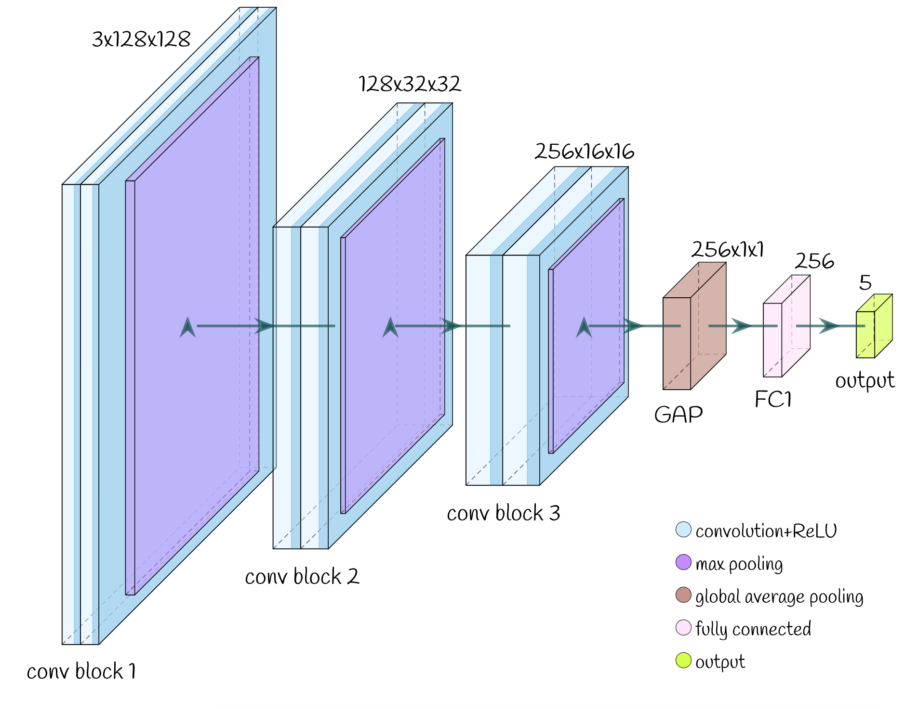

# 🌄 Landscape Image Classifier using a Convolutional Neural Network (CNN)


In this project, I created a convolutional neural network (CNN)-based classifier that learns to recognize and categorize various landscape images - such as forests, mountains, glaciers, deserts, and coasts. The CNN processes image data by scanning with filters to detect features like edges and textures, then learns patterns across multiple layers to classify the image into the correct category. See the infographic above for details!

---

## Model Architecture



The network consists of:
- Multiple convolutional blocks to extract image features
- MaxPooling layers to progressively reduce spatial dimensions
- Global Average Pooling (GAP) to make the model input-size flexible
- Fully connected layers to perform final classification

Training loss started at **~75%** and improved to **~3.54%**, indicating confident and accurate predictions across categories.

---

## Training Results

Here’s an example of the model’s predictions towards the end of training:


As you can see, the classifier successfully predicts a range of landscapes including forests, deserts, glaciers, and mountains!

---


## Setup and Usage

1. **Clone the repository**
   ```bash
   git clone git@github.com:smiley-maker/Landscape-Classification.git
   cd Landscape-Classification
   conda create -n landscape-classification python=3.10
   pip install -r requirements.txt

--- 

## Project Structure

The project is structured like a python library, and is installable using setup tools. The src directory contains subdirectories for model architectures, data handlers, pipelines, results, trainers, and utilities. The pipelines are essentially like a frontend accessing each element of the library, and are what would be run to train the model. Currently, I've implemented a CNN architecture and training script with the landscapes data handler. This pipeline can be run as follows from the root directory. 

```bash
python -m src.pipelines.landscape_cnn_pipeline
```

## Next Steps

- Add validation loss and accuracy tracking

- Implement Batch Normalization and Dropout

- Try learning rate scheduling for even better convergence

- Improve dataset diversity and test generalization

- Explore model interpretability tools (e.g., Grad-CAM)

- Explore alternative models and loss functions

